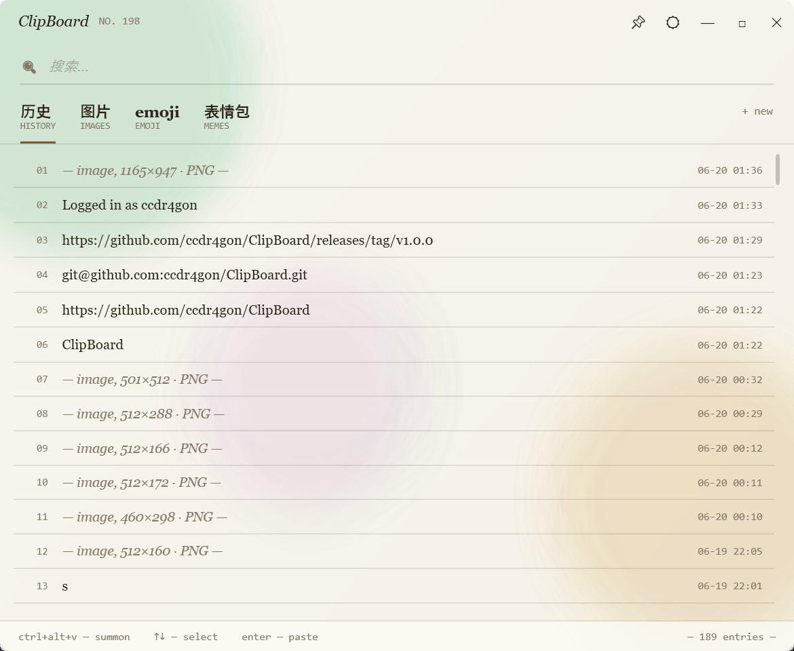

<div align="center">

# 📋 ClipBoard

**Windows 托盘 / macOS 菜单栏剪贴板管理器**

文本 · 图片 · GIF · 文件 历史 ｜ 收藏夹 ｜ 表情包 ｜ Emoji ｜ 全局热键

[](https://github.com/ccdr4gon/ClipBoard/releases/latest)
[](https://github.com/ccdr4gon/ClipBoard/releases/latest)
[](https://dotnet.microsoft.com/)



</div>

## ✨ 特性

- 📋 **多类型历史** — 自动记录文本、图片、GIF、文件；最多保留 200 条，自动去重相邻重复项。
- 🗂️ **智能分页** — 历史 / 图片 / Emoji / 表情包，以及你自定义的收藏夹。
- 📝 **保留格式** — 从网页、聊天（如 Claude、ChatGPT）、Word 复制的文字会同时记下 HTML / RTF，条目旁显示「格式」。回车粘贴保留列表编号和粗体，`Shift` + 回车粘贴纯文本；网页纯文本缺少的列表编号会从 HTML 补回。
- ⭐ **收藏 & 顶置** — 右键顶置常用条目，或收藏到文件夹长期保存。
- 🎨 **表情包导出** — 一键导出为多种规格：微信 (240)、Telegram (512)、QQ (240)、WhatsApp (512 WebP ≤100KB)、原图。
- 🔗 **GIF 智能识别** — 从复制的网页内容中识别并下载 `.gif` 动图。
- 😀 **Emoji 面板** — 内置 Emoji 选择与粘贴。
- 👻 **不可见字符高亮** — 可选显示 ZWSP / BOM / 控制码等（如 `<U+200B>`），排查隐藏字符利器。
- 🚀 **开机自启动** — 通过当前用户注册表 `Run` 项实现（无需管理员），默认开启，启动时回读注册表自校验。
- 🧠 **低内存占用** — 图片在内存中只保留缩略图、全分辨率原图留在磁盘按需加载，长时间复制大量大图也不会内存膨胀或崩溃。
- 🖱️ **拖入拖出** — 把条目拖到其它程序，或把文件 / 图片直接拖进收藏夹。
- 🔔 **托盘常驻** — 托盘图标 + 右键菜单，安静运行。

## ⌨️ 快捷键 & 操作

| 操作 | 说明 |
| --- | --- |
| `Ctrl` + `Alt` + `V` | 唤出剪贴板面板 |
| `↑` / `↓` | 选择条目（打开面板时自动选中第一条） |
| `Enter` / 单击 | 粘贴选中条目，保留原格式 |
| `Shift` + `Enter` / `Shift` + 单击 | 粘贴为纯文本 |
| 双击托盘图标 | 显示面板 |
| 右键条目 | 顶置 / 收藏到文件夹 / 查看图片信息 等 |
| 顶部搜索框 | 实时过滤历史 |

## 📦 安装

### macOS

提供 Apple Silicon 和 Intel 两种构建，要求 macOS 13+。保留标签页和卡片布局，支持历史缩略图、收藏、Telegram 贴纸导入、GIF 编辑和发布更新。

在 [v1.1.2 正式版](https://github.com/ccdr4gon/ClipBoard/releases/tag/v1.1.2) 下载 `ClipBoard-1.1.2-macos-arm64.zip`（M 系列）或 `ClipBoard-1.1.2-macos-x64.zip`（Intel）。主面板已按 Windows 的紧凑列表和纸片卡片布局对齐，并修复设置弹窗被置顶面板遮挡的问题。

```sh
python3 scripts/package-macos.py --arch arm64  # M 系列 Mac
python3 scripts/package-macos.py --arch x64    # Intel Mac
```

应用输出到 `dist/macos-对应架构/`；动画处理需 `brew install ffmpeg`。
快捷键为 `⌃⌘V`。安装、权限、签名、数据迁移和功能范围见 [macOS 使用说明](docs/macos.md)。

### 下载（推荐）

Windows 安装包见 [**Windows v1.0.3 Release**](https://github.com/ccdr4gon/ClipBoard/releases/tag/v1.0.3)；最新 macOS 修复版单独提供上面的 Mac 下载文件。

> **自包含单文件，无需安装 .NET 运行时**，双击即用。首次运行会自动注册开机启动（可在设置里关闭）。

### 从源码构建

需要 [.NET 8 SDK](https://dotnet.microsoft.com/download)（Windows）。

```bash
# 克隆
git clone git@github.com:ccdr4gon/ClipBoard.git
cd ClipBoard

# 直接运行
dotnet run --project src/ClipBoard/ClipBoard.csproj

# 或发布为自包含单文件
dotnet publish src/ClipBoard/ClipBoard.csproj -c Release -r win-x64 `
  --self-contained true -p:PublishSingleFile=true `
  -p:IncludeNativeLibrariesForSelfExtract=true -p:EnableCompressionInSingleFile=true
```

## Telegram 表情包管理

“表情包”页内直接支持导入 Telegram 整包，导入后新增一个标签页并沿用原卡片样式。支持 GIF/WebM/TGS、保留原件、右键裁剪加字、动画截取，以及发布到自己的 Telegram 账号后按项更新。
首次构建请运行 `./scripts/Setup-MediaTools.ps1` 安装媒体组件。机器人配置、使用方式和验证命令见 [Telegram 表情包管理说明](docs/telegram-stickers.md)。

## ⚙️ 设置

托盘图标右键 → **设置…**：

- **开机时自动启动** — 写入 / 删除注册表 `Run` 项并回读校验（默认开启）。
- **显示不可见字符编码** — 高亮文本里的 Unicode 格式 / 控制字符。

## 🗂️ 数据存储

所有数据保存在 `%AppData%\ClipBoard\`：

| 文件 / 目录 | 内容 |
| --- | --- |
| `data.json` | 历史、收藏夹、设置 |
| `blobs\` | 图片 / GIF 原始数据 |
| `startup.log` | 每次启动的开机自启动自校验记录 |

## 🛠️ 技术栈

- **.NET 8 · WPF**
- [Hardcodet.NotifyIcon.Wpf](https://github.com/hardcodet/wpf-notifyicon) — 托盘图标
- [Emoji.Wpf](https://github.com/samhocevar/emoji.wpf) — Emoji 渲染
- [SkiaSharp](https://github.com/mono/SkiaSharp) — WebP 编码
- [WpfAnimatedGif](https://github.com/XamlAnimatedGif/WpfAnimatedGif) — GIF 播放

## 📄 License

暂未声明开源许可证（保留所有权利）。如需开源可自行添加 MIT / Apache-2.0 等。
